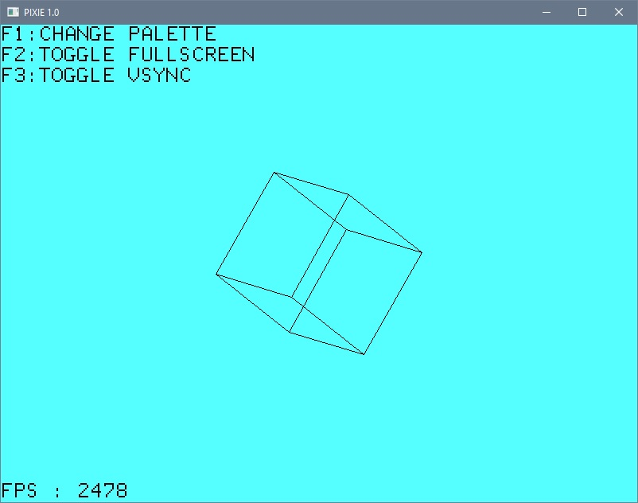
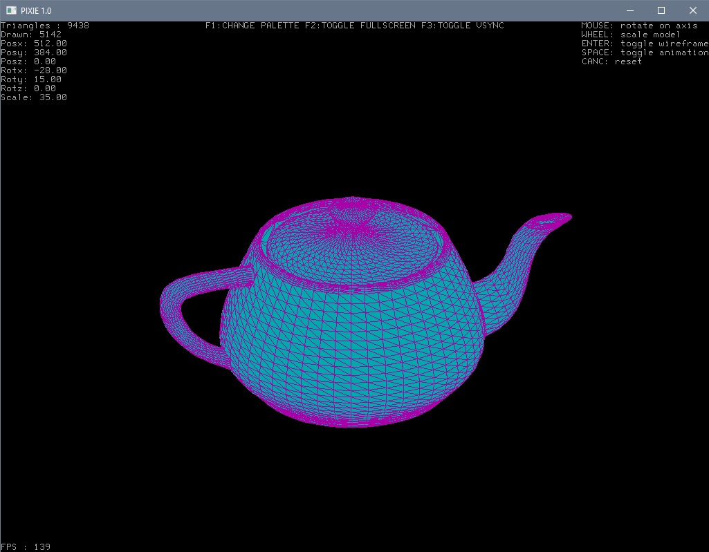

# PIXIE 

Pixie e' una libreria scritta in C che permette lo sviluppo di applicazioni multimediali in stile retro.

Lo scopo di Pixie e' quello di rendere disponibili le funzioni base necessarie alla creazione dei programmi, gestendo quella parte di programmazione considerata "noiosa" e lasciando subito spazio alla creatività.

Pixie si occupa di tutte le routines di inizializzazione e fornisce una semplice interfaccia per gestire grafica, suoni, input, files audio, files immagini e fonts.

Questo progetto puo' risultare limitato in alcune sue parti o presentare un' implementazione non particolarmente elegante o efficiente ma lo scopo e' sviluppare il software dalle fondamenta senza prendere scorciatoie, avendo consapevolezza di quello che si sta facendo e per quale motivo, nella maniera piu' semplice possibile.

Non esitate infine a segnalare errori, suggerire modifiche o proporre estensioni per migliorare le funzionalita' di Pixie.

Bentornata CGA !!!

 

